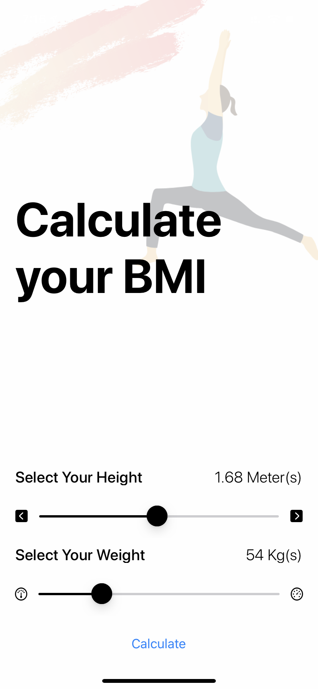
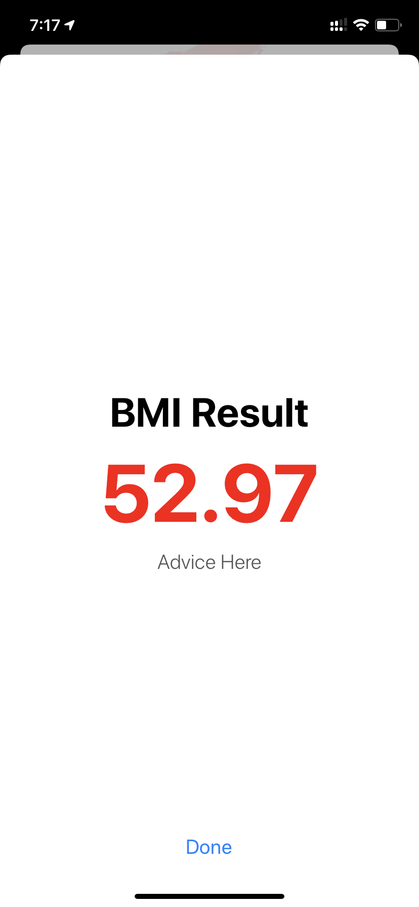
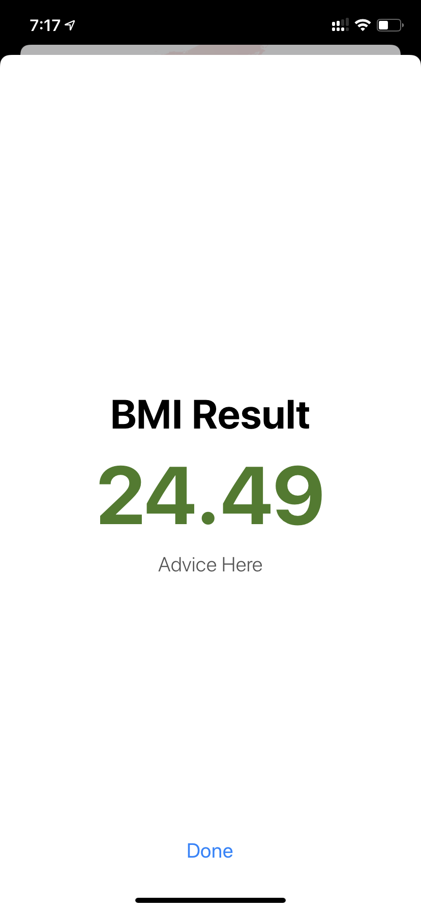

#  BMI Calculator for iOS

This app is created using the MVC Design Pattern. Graphics and the UI is designed by [theroyakash](www.iamroyakash.com)

Here we have made a Body Mass Index calculator. Based on the user’s weight and height it will calculate their body mass and give a piece of health advice depending on the result.

## Design: 

### If you are fat:

### You are ok:

